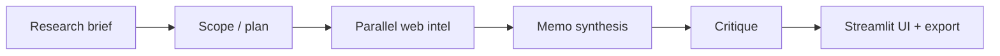

# Market Intel Agent — User & publish guide

**Market Intel Agent** is a [Streamlit](https://streamlit.io) app that turns one free-text **research brief** into an **executive-style competitive intelligence memo**: web-backed evidence, numbered citations, optional charts, clickable links, machine critique (as follow-up questions), and a Markdown export.

Anyone with a normal laptop, Python, and (for live runs) two API keys can run or host it.

---

## What you get

| Mode | Keys | What happens |
|------|------|----------------|
| **Demo** | None | Loads a built-in sample memo instantly — good for UI tours and training. |
| **Live** | OpenAI + Tavily | Plans scope, searches the web in parallel, synthesizes a fresh memo (~a few minutes). |

**Outputs (Memo tab):** executive hero strip, **full cited memo** (complete `full_markdown`: all sections the model wrote, including tables and citations), machine-critique snapshot, **bar charts** (coverage and news sentiment by company), market context expander (when present), bibliography, **Export as .md** (memo + critique footer).

**Other tabs:** **Follow-ups** (open questions + optional “revise memo” using critique), **Social & Reviews** (summary of sentiment by company), **Sources** (memo bibliography).

---

## Prerequisites

- **Python 3.11+** (3.11 matches `runtime.txt` for cloud; 3.12+ usually works locally).
- **Git** (if cloning from GitHub).
- **Live mode only:** [OpenAI API key](https://platform.openai.com/api-keys) and [Tavily API key](https://app.tavily.com/) (free tier available for light use).

---

## Option A — Clone this folder only (monorepo path)

If you use the repo that **contains** this directory:

```bash
git clone https://github.com/bobpmprojects/Generative-AI-Projects_bob.git
cd Generative-AI-Projects_bob/market-intel-agent
python -m venv .venv
```

**Windows**

```powershell
.\.venv\Scripts\activate
pip install -r requirements.txt
streamlit run app.py
```

**macOS / Linux**

```bash
source .venv/bin/activate
pip install -r requirements.txt
streamlit run app.py
```

Open the URL Streamlit prints (usually **http://localhost:8501**).

---

## Option B — Clone the `market-intel-agent` product repo (submodule layout)

Some releases ship the app behind a parent repo that uses a **submodule** for this code.

```bash
git clone --recurse-submodules https://github.com/bobpmprojects/market-intel-agent.git
cd market-intel-agent
```

Then either:

```bash
streamlit run app.py
```

(the repo root `app.py` launches the app inside `Generative-AI-Projects_bob/market-intel-agent/`), **or**:

```bash
cd Generative-AI-Projects_bob/market-intel-agent
streamlit run app.py
```

If `Generative-AI-Projects_bob/` is empty:

```bash
git submodule update --init --recursive
```

**Windows helper** (from repo root): `.\run-market-intel.ps1`

---

## Configuration (.env and Streamlit secrets)

### Local `.env` (optional)

```bash
cp .env.example .env
# Edit .env — OPENAI_API_KEY and TAVILY_API_KEY
```

The app also reads the environment; `python-dotenv` loads `.env` when present.

### Sidebar (session-only)

With **Demo Mode OFF**, you can paste keys in the sidebar for that session. They are **not** written into the repo by the app.

### Streamlit Community Cloud **Secrets**

In the deployed app: **Settings → Secrets** (TOML), for example:

```toml
OPENAI_API_KEY = "sk-..."
TAVILY_API_KEY = "tvly-..."
```

Demo Mode can stay **ON** for visitors who should not consume your credits.

---

## How to use the app (for end users)

1. Open the app in the browser.
2. **Demo Mode:** leave **ON** and click **Generate Memo** for an instant sample (no keys).
3. **Live run:** turn **Demo Mode OFF**, ensure keys are set (secrets or sidebar), edit the **Research Brief** if you like, click **Generate Memo** once.
4. Wait for the status steps to finish (~2–4 minutes typical; depends on company count and models).
5. Read the **Memo** tab — the **Executive memo (full cited)** block is the complete Markdown report (same as export body).
6. Use **Follow-ups** for suggested next questions; optionally **Revise memo** (live + OpenAI only).
7. **Export as .md** downloads the memo plus confidence/risks footer.

**Live session limit:** the app may limit live runs per browser session (by design in the template); refresh or self-host to reset.

---

## Publish on **Streamlit Community Cloud** (free tier friendly)

### From the **monorepo** (simplest; no submodule)

1. Push or fork [Generative-AI-Projects_bob](https://github.com/bobpmprojects/Generative-AI-Projects_bob).
2. In [Streamlit Community Cloud](https://streamlit.io/cloud): **New app** → pick repo/branch.
3. **Main file path:** `market-intel-agent/app.py`
4. **Python:** matches `market-intel-agent/runtime.txt` (3.11).
5. **Secrets:** add `OPENAI_API_KEY` and `TAVILY_API_KEY` if you want live mode.
6. **Deploy.** Share the `*.streamlit.app` URL.

### From the **parent `market-intel-agent` repo** (submodule)

1. Ensure the GitHub repo has **submodules checked out** in the branch you deploy (push includes submodule pointer).
2. In Streamlit Cloud **Advanced settings**, enable **submodules** if offered.
3. **Main file path:** `app.py` (repo root launcher) **or** `Generative-AI-Projects_bob/market-intel-agent/app.py`.
4. Add the same **Secrets** as above.

### After deploy

- Smoke test **Demo Mode** first.
- Turn on **live** only when secrets are set and you accept API cost.

---

## Cost & time (rough order of magnitude)

- **Demo:** ~$0, a few seconds.
- **Live:** depends on model choice, number of companies, and cache hits; the original product target was on the order of **~US$0.30–0.50 per multi-company run** and **~2–4 minutes** wall clock. Set [OpenAI billing limits](https://platform.openai.com/account/billing/limits) and monitor Tavily quota.

---

## Architecture (high level)



---

## Troubleshooting

| Issue | What to try |
|--------|-------------|
| `File does not exist: app.py` | Run Streamlit **from** `market-intel-agent/` (see paths above), or use the **full path** to `app.py`. |
| Submodule folder empty | `git submodule update --init --recursive` |
| Old UI / wrong tabs | Hard refresh (`Ctrl+Shift+R`); stop all Streamlit processes; run the correct `app.py` path. |
| OpenAI / Tavily errors | Check keys, model availability (e.g. GPT‑5.x vs GPT‑4o), and error text in the UI. |
| Streamlit Cloud sleep | Cold start after idle; normal on free tier. |

---

## Repository links

- **Product / umbrella repo:** [github.com/bobpmprojects/market-intel-agent](https://github.com/bobpmprojects/market-intel-agent)  
- **Monorepo (this tree):** [github.com/bobpmprojects/Generative-AI-Projects_bob](https://github.com/bobpmprojects/Generative-AI-Projects_bob)

---

## Known limitations

- Search and snippet quality depend on Tavily and public web coverage.
- Publication dates and paywalled content are best-effort.
- Automated critique is **not** a human compliance sign-off.

---

## License

Add a `LICENSE` file in your fork if you need explicit terms; the template ships without one by default.
